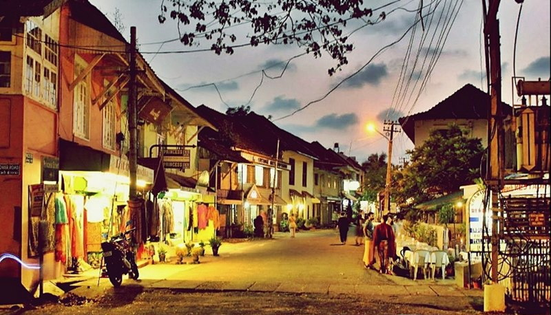
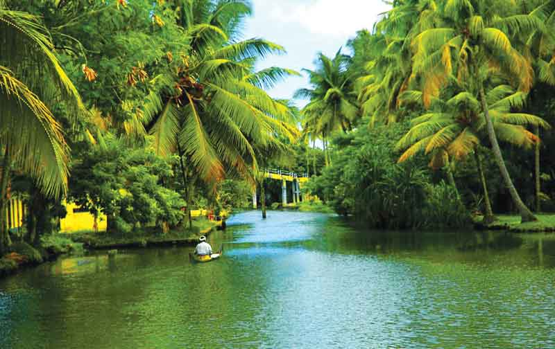
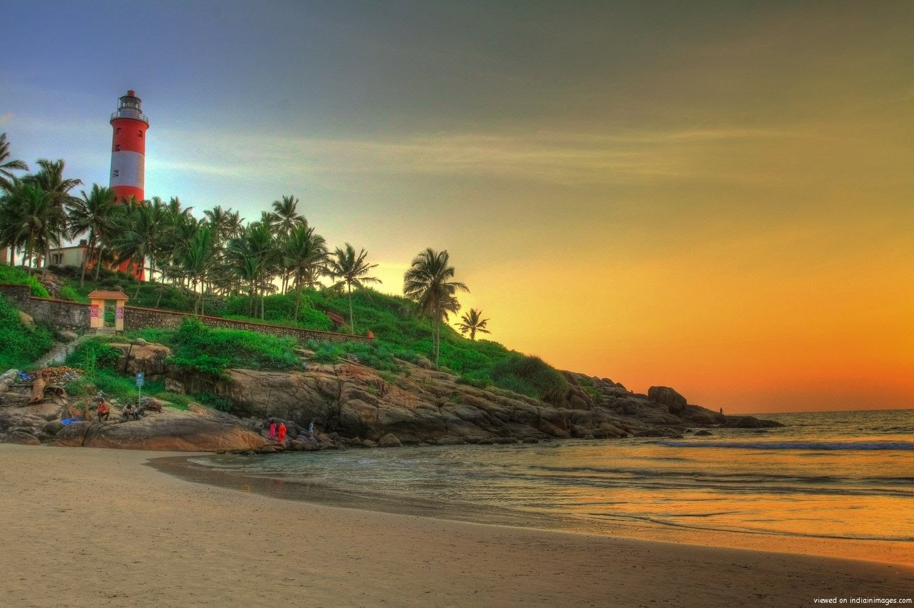
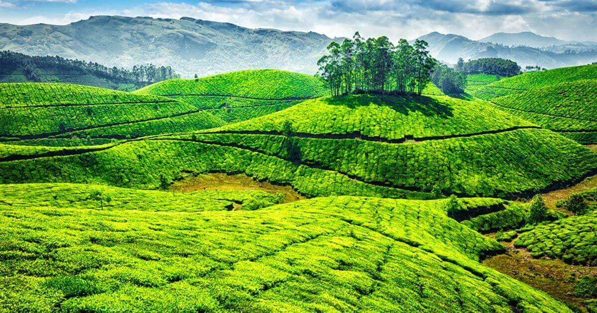

## South India
The main problem with the visit of the region is due the fact that we plan to visit it at the end of May till the begining of June, when the monsoon start.
The major attraction and a  possible itinerary to visit south india in 3 weeks is shown in the map below:

<iframe src="https://www.google.com/maps/d/embed?mid=1zBUKQjK7dzyUYOBjJUY6tkHp_Z8o_A83" width="100%"  height="480"></iframe>

To avoid the meteo problem and so the monsoon I propose to start from the _Kerala_ state (where it hit first) and then climb to the north till _Goa_.

### Kerala
The most loved region of India from backpackers and turists, people are warm and lovely and the nature is great and varied. The most known sight is the _Backwater region_, but the old colonial cities, the hill with the tea plantation and the beaches as wonderful as well.

#### Kochin

An old colonial city with a very active port and varied architecture, is a good entry point to the region as it possible to arrive here by bus, train and plane.
A part to enjoy the port life, there are some interesting sightseeing to do here, such as the _Fort Cochin and Mattancherry_, the _Dutch Palace_ and the different religious centers. From here is possible to do a daily excursion on the backwater (45 min bus to _Vaikom_).

**How long:** 1 night without excursion on backwater, 2/3 night with excursion.

#### Backwater

This lacustrine region just few kilometers from the ocean is beatiful and relaxing, it is possible to organize excursions from different points, _Kochin_ (as already introduced) but more popular choices are: _Alleppey_, _Quilon_ and _Kottayam_. 
It is possible however to sleep on place to enjoy even more the ambience of this place, the best lake hotels are in _Kumarakom_ (but chic).

**How long:** daily excursion plus 1 night at _Kumarakom_.

#### Alleppey

Alleppey is not only a great entry point to the _backwater_ but has as well a great beach. 

#### Munnar

