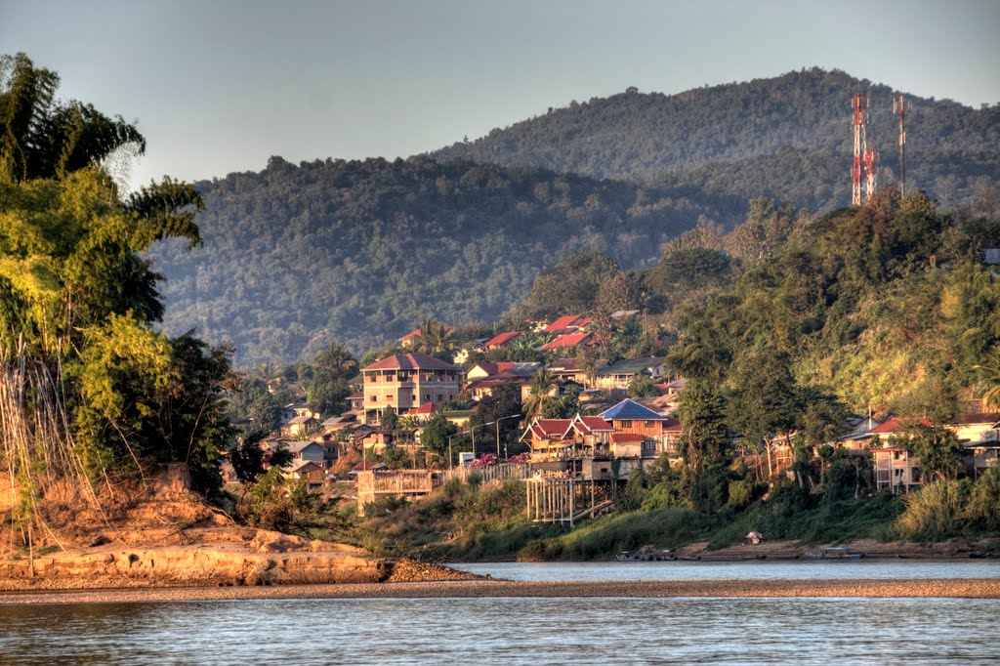

Laos can be divided in 3 main regions, the north, the center and the south reagion. This is the only country of the Indochina Peninsula without access to the sea and it is sorrounded by China in the North, Myanmar in the North-West, Thailand in the West, Cambodia in the South/South-West and Vietnam in the East side.
During the _Vietnam War_ and the _Secret War_ it has been bombarded by americans and most of the cities has been destroyed, morever an huge quantity of unexploded bombs are still around, during this time the country recived the biggest number of bomb of the entire history.

## Formalities
**Visas** are needed however it is possible to do it on arrival at the main airport and at most of the land crossing (complete list and more information [here](http://www.laos-guide-999.com/laos-visa-on-arrival.html)). 
A valid passport and a picture are required at the border and the cost should be of around 30$.

## North Laos

This will be probably the first region we will visit, the access can be done or by plane to one of its main airports (*Vientiane* or *Luang Prabang*) or by land at one of the Thai-Laos border crossing point (probably at _Chiangkhong – Houixay_ border).

### Huay Xai

_Huay Xai_ is one of the possible entry point to Laos for our trip, it is situated in the West extrimity of Laos over the Thailand Border. The city itself is nice and calm however its main attraction is the **Gibbon Experience** that start from here even if it is located in the _Bokeo_ natural park.

**Nights: 1 in the city, 3 for the Gibbon Experience**

|  From  | Medium | Time | Cost |
| :----- | :----- | ---: | ---: |
| Luang Prabang| | | |
| Vientiane | Bus | xxxx | xxxx |
| xxxx | Boat | 2 days | xxxx |

### Luang Prabang

Fortunatly is one of the few cities untouched by the USA bombing, as it was the base of USA allied forces, this is the most beutiful and pleasant city of _Laos_, reach of temples, monuments and old bulding. Spending few days between the Mekong and the Nam Ou river is highly racomendet, Luang Prabang was the ancient capital of the _Laos Kingdom_ (before the French moved the capital to _Vientiane_) and preserve today a relaxed ambience, excellent food and nice country side.

**Nights: 3/4**

|  From  | Medium | Time | Cost |
| :----- | :----- | ---: | ---: |
| Anywhere | Plane | nd | nd |
| Vientiane | Bus | xxxx | xxxx |
| xxxx | Boat | 2 days | xxxx |

### Nam Ou (Muang Ngoi Neua)

It is possible to spend few days to enjoy the river life on this carsic  and impressive valley, kayak and crouise will be the highlight of Nam Ou, just on north of _Luang Prabang_.

**Nights: 1/2**

|  From  | Medium | Time | Cost |
| :----- | :----- | ---: | ---: |
| Nong Khiaw | Boat | 1h | 25'000 Lak |
| Luang Parabang | Bus | 5h30 | 60'000 Lak |

### Phongsali

Phongsali is the main city in the northest part of _Laos_ close to _China_, this altitude city is the ideal base to explore the sorounding mountains, land of many differents and interesting cultures. Treks from 1 to 5 days are possibles here.

**Nights: depending on trek (min 3)**

|  From  | Medium | Time | Cost |
| :----- | :----- | ---: | ---: |
| Luang Prabang | Bus| 10h | 140'000 Lak |
| Udomaxai | Bus | 7h | 80'000 Lak |
| Vientiane | Bus | >20h | 250'000 Lak |
| Nam Ou | Bus | 13h | ? |  

### Vientiane

Another splendid city of _Laos_ on the border of the _Mekong_, it is the capital of the country since the french colonization, presents beautiful colonial building, temples and a pleasent life-style (and excellent food).

**Nights: 2/3**

|  From  | Medium | Time | Cost |
| :----- | :----- | ---: | ---: |
| Anywhere | Plane | nd | nd |
| Luang Parabang | Bus | xxxx | xxxx |

### 
