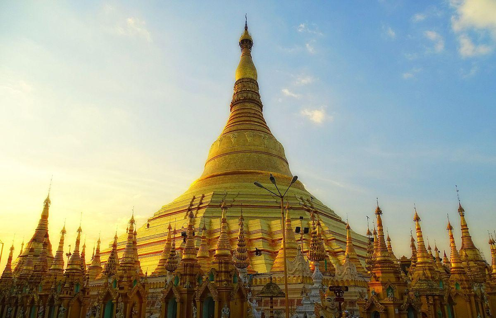
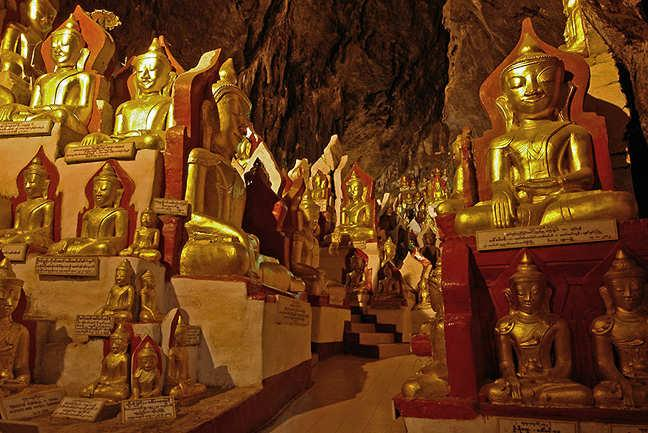

## Informazioni Utili

**Visa: **procedura su internet ([link](https://evisa.moip.gov.mm/)) e recupero all'aeroporto (possibile solo con ingresso via aereo in una delle capitali), durata di 28 giorni.

**Moneta:** ATM disponibili nel paese e uffici di cambio all’aeroporto come in come in città.

**Budget:** pernottamento tra i 20 e i 90 euro nelle zone non turistiche e tra i 20 e fino ai 300 euro nelle zone turistiche nell’alta stagione.

**Sicurezza: **molte zone di confine sono inaccessibili, inoltre permessi sono richiesti per visitare molte parti del paese.

## Itinerario

### Yangon

Capitale economica (ed amministrativa fino al 2005) del paese, e punto di ingresso principale. Tra le cose da vedere ci sono il centro storico divisa in China Town, New Delhi* *e Downtown. Di particolare interesse è la pagoda rivestita in oro di Shwedagon (da visitare di giorno ma anche al tramonto per poter apprezzare i colori e l’illuminazione del tempio).

**Notti: **2 

**Accesso: **aereo, bus e treno 

### Kinmon

Primo punto d’interesse per la parte sud del paese, la roccia d’oro, luogo sacro di pellegrinaggio e’ raggiungibile sia a piedi (una camminata molto dura di 11km e 6h, raccomandata in discesa) che in camion/bus (la scelta più comune). Prevedere una giornata intera per raggiungere la visita, anche perchè i momenti migliori sono all’alba e al tramonto.

**Notti: **1

**Accesso:	**in bus (5-6 ore) da/per Yangon fino a Kinmon (ai piedi della roccia)

in treno (4 ore) da/per Yangon fino a Kyaik-Hti-Yo, 10 km da Kinmon 

### Mawlamyaine

Città posta lungo uno dei fiumi che discendono direttamente dal Tibet, nel passato importante porto fluviale oggi piacevole città ricca di storia e cultura. Sormontata dalla collina dei templi di cui di notabile interesse il monastero di Kyaung Seindon (in foto).

Nei dintorni e facilmente accessibili in barca sono presenti le isole di Kyun Gaungse e di Bilu Gyun che valgono la pena essere visitate.

**Notti: 2-3 notti**

**Acesso:	**bus da/per Kinmon (vedi sopra) 3 ore (4 volte per giorno)

		treno da/per Kyaik-Hti-Yo (vedi sopra) 5 ore (3 volte per giorno)

### Hpa Ana

Più che la città in se l’interesse sta nella regione, templi, grotte e cascate sono magnifiche. Tra le quali: Saddan Cave (1h di macchina dalla città), Lumbini Garden (30 min di macchina), Zwe Ga Bin mount (un ora e mezza di cammino per arrivare alla cima), waterfall (5 min dalla strada per Zwe Ga Bin), Kaw Gone Cave (30 min di macchina), Yathei Pan Cave  (raggiungibile dalla Kaw Gone Cave).

**Notti: **3

**Accesso:	**bus da/per Malawayne 2 ore (ogni 30min/1 ora)

		bus da/per Yangon 7 ore (2 al giorno VIP, molti normali)

		barca da Malawayne (molto bello) 4 ore (da organizzare la notte prima)

### Bagan

Sito archeologico unico ed indescrivibile, oltre 2000 templi e pagode dispersi in 42 kmq riempiono questo vero e proprio museo all’aria aperta. Antica capitale del regno fino al XIII secolo prima dell’abbandono dovuto alle escursioni mongole presentava oltre 4000 templi ed edifici sacri (per la costruzione dei quali la foresta è scomparsa). È possibile visitarla in bici o in carrozza o ancora in mongolfiera. Le parti abitate sono 3, la *old Bagan, new Bagan e Nyaung Oo*. Il primo è composto soprattutto da Hotel e pure cari, il secondo è un borgo nuovo ed in espansione il terzo è un buon compromesso tra locali, hotel e storia.

**Notti: 2-3**

**Accesso: 	**bus da/per Yangon 10-11 ore (6 per giorno)

		bus da/per Mandalay 4-6 ore (6 per giorno)

		bus da/per Kalaw (lago Inle) 8-9 ore (3 per giorno)

		bus da/per Mont Popa 2.5 ore (1 per giorno)

		aereo da/per Yangon, Mandalay, Heho (lago Inle) una o più volte al giorno

		treno da/per Yangon 17.5 ore (1 per giorno)

		treno da/per Mandalay 7.5 ore (1 per giorno)

		speed boat da/per Mandalay 10-13 ore (35-40 euro, 1 per giorno)

		slow boat da/per Mandalay 2 giorni (12-15 euro)

### Mandalay

Ultima capitale del regno prima della conquista inglese, costruita per onorare la volontà del Buddha per i suoi 2500 anni dopo la morte a solo 30 km dalla capitale precedente. 

Ricoperta di templi e monasteri rimane la seconda città della Birmania oltra la capitale religiosa. Tra i monumenti più importanti: la pagoda Mahaumini pagoda, Golden Palace monastery, e il mercato della Giada. Inoltre le altre 4 precedenti capitali si trovano tutte in zona: Amarapura (raggiungibile in bici, notabile il ponte U Bein bridge, di 1.2km in legno sul lago [in particolare al tramonto]), Inwa (anche in bici), Mingun (notabile la pagoda) e Sagaing.

**Notti: **2-3 notti

**Accesso: 	**bus da/per Yangon 8-10 ore (6 per giorno)

		bus da/per Bagan 8 ore (6 per giorno)

		bus da/per Kalaw (lago Inle) 8-9 ore (3 per giorno)

		aereo da/per Yangon, Mandalay, Heho (lago Inle) una o più volte al giorno

		treno da/per Yangon 15 ore (3 per giorno)

		treno da/per Bagan 6-7 ore (1 per giorno. di notte)

		speed boat da/per Bagan 8-9 ore (40-50 euro, 1 per giorno)

		slow boat da/per Bagan 10 ore (12-15 euro)

### Kalaw

Punto d’accesso per diverse camminate, tra cui quella che porta al lago Inle, è una cittadina piacevole di collina, offre un interessante mercato e qualche pagoda. 

Tra le camminate più interessanti spicca quella per il lago Inle, 3 giorni e 2 notti nei sentieri abitati da diverse etnie locali. 

Altrimenti in 2 giorni si può raggiungere Pindaya.

**Notti: **1

**Accesso: **	bus da/per Mandalay 8-9 ore (2 per giorno)

		bus da/per Bagan 8-9 ore (2 per giorno)

		bus da/per Yangon 11 ore (2 per giorno)

		bus da/per Nyaungshwe (lago Inle) (vari)

### Pindawa

Conosciuta soprattutto per la grotta dei 8000 Buddha (in foto) è una cittadina molto piacevole con un lago al centro, e un ottimo mercato, inoltre è possibile visitare a piedi in 2-3 giorni la regione abitata dalla minorità Da-Nu.

**Notti: 1-4**

**Accesso: 	**a piedi da Kalaw (2 giorni di cammino)

		bus per/da Kalaw fino a Aung Ban (11km) 

		bus per/da Mandalay fino a Aung Ban (11km) 8 ore 

		bus da/per Nyaungshwe (lago Inle) (1 il mattino presto)

### Lago Inle

Secondo lago per superficie della Birmania ospita circa 40 villaggi su piloti. Atmosfera magica, tra pescatori Intha (etnia che occupa il lago, probabilmente immigrata dal sud dal passato), i giardini e gli orti galleggianti (soprattutto pomodori) e ovviamente le case su piloti. Possibilità di giri in barca ma anche in bici.

**Notti: **2-3

**Accesso: **da Nyaungshwe, villaggio più a nord del lago, ma collegato attraverso canali è possibile accedere al lago.

		Aereo fino a Heho (28 km da Nyaungshwe) da tutti i maggiori aeroporti

		bus da/per Kalaw (1 tutte le ore)

		bus da/per Yangon 12 ore (8 per giorno)

		bus da/per Bagan 9 ore (2 per giorno)

		bus da/per Mandalay 11 ore (6 per giorno)

		treno per Yangon 30 ore (1 per giorno)

		treno per Mandalay 2 giorni (11 ore fino a Shwenyaung e poi il mattino dopo 3 

ore fino a Mandalay)

### Triangolo d’Oro

Regione conosciuta principalmente per la produzione di oppio presenta una grande varietà di etnie di montagna molto diverse ed isolate. Oltre ai trek in giornata per esplorare i dintorni e incontrare le diverse etnie è possibile da qui raggiungere la Thailandia per bus. La città principale della zona è Kengtung **sola città **aperta ai turisti. Nella città è presente un ottimo mercato, un monastero e un tempio degni di nota, oltre ovviamente alle camminate al incontro con le tribu locali.

**Notti: **2-3

**Accesso:	**per aereo dal Myanmar

		in bus da/per la Thailandia passando per Tachilek (3 al giorno)

### Golfo del Bengala

Composta da due regioni quella accessibile di Ayeyarwady e quella invece in guerra di Rakhine possiede varie stazioni balneari interessanti: Ngapali (nel sud del Rakhine), Chaungtha e Ngwe Saung (nel Ayeyarwady). 

Ngapali (in foto) è la destinazione più conosciuta e ricercata, dove sono presenti diversi hotel di lusso e i costi sono più elevati.

Ngwe Saung è meno turistica,  ma però sta anch’essa crescendo di importanza turistica. Infine Chaungtha è più popolare e familiare come destinazione a livello di prezzi e di target.

**Notti: **2-3 notti

**Accesso: **	per Ngapali la solo in aereo fino a Thandwe

		per Ngwe Saung in bus da Yangon 6 ore (2-3 volte al giorno)

		per Chaungtha in bus da Yangon 6 ore (3 volte al giorno)
