## Introduction

A simple itinerary of what could be our travel in Nepal.
<iframe src="https://www.google.com/maps/d/embed?mid=1rbnrdcPfvtTymCUtYUrc8oE3J1Eml_vE" width="100%" height="480"></iframe>

|  Days | Where            | What                                     |
| ----: | ---------------- | ---------------------------------------- |
|     1 | Kathmandu        | Arrival and visit of the historical center |
|     2 | Kathmandu        | Conclusion of the visit and last minutes shopping |
|   3-8 | ?                | First 5 days of volunteering             |
|  9-10 | Kathmandu Valley | During weekend break visit to the valley |
| 11-16 | ?                | Last 5 days of volunteering              |
| 17-29 | Trek             | Trekking over Himalayas                  |
|    30 | Kathmandu        | Departure (by plane or by bus)           |

## To visit

### Kathmandu

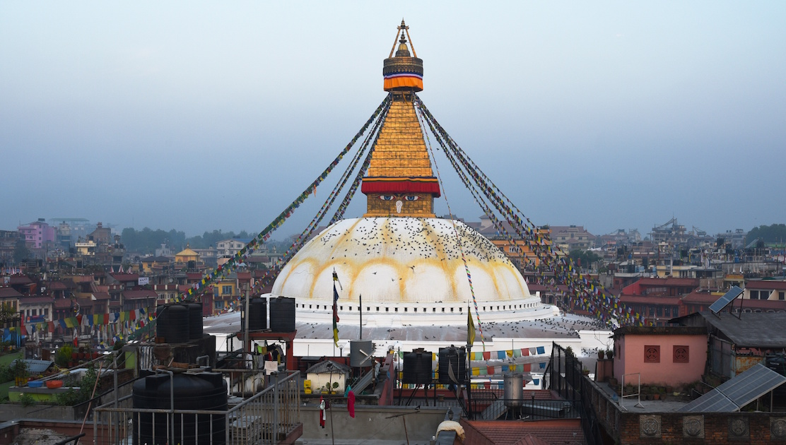

Entry hub for most of the travelers offer many beautiful temples and pagodas, old buildings and possibility of shopping. The time to spend to 

Here is possible to buy or rent some trek and camping gear if needed. 

The main attractions are in the city centers between *Thamel* and *Durbar Square*, as well as the *Bodhnath Stupa* (in the picture) and the *Monkey Temple* not far from the center is worth to visit.

### Kathmandu Valley

Rich of old cities (some old capitals of the kingdom) and temples it offer wonderful visit possibilities. It is possible to visit this area in few days as well as in weeks, depending on the detail level desired.

#### Patan

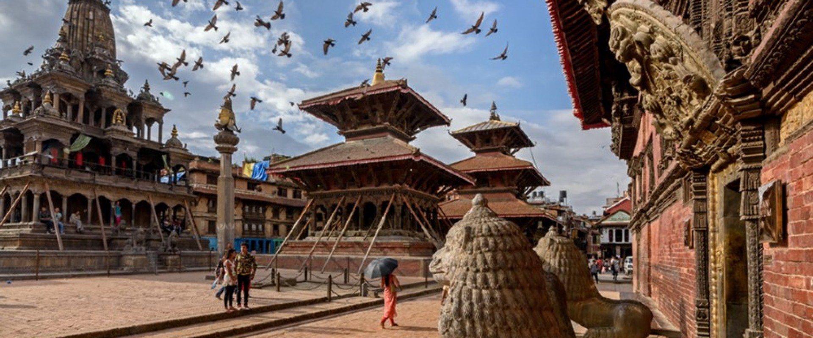

This city that survived in part to the 2015 earthquake is reach in temples and monasteries, such as the *Vishnu temple* or the *Golden temple*. It is also known for its beautiful palace in the *neware* style. One day and one night can be enough to visit. 

#### Bhaktapur

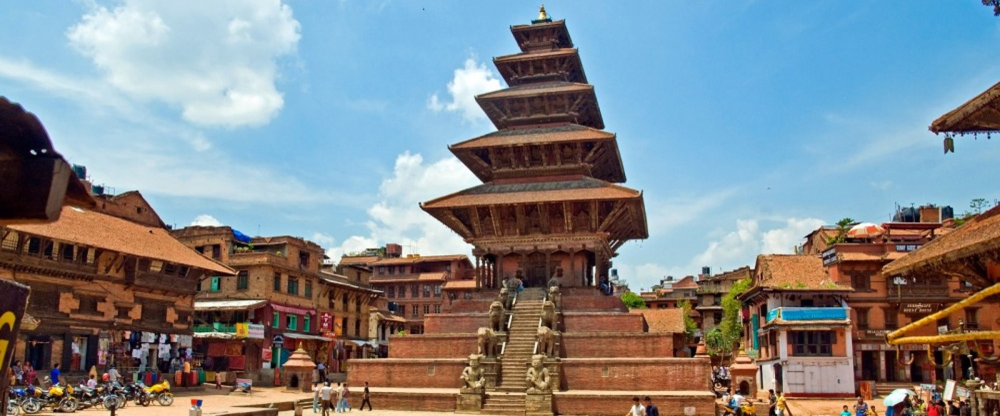

Ancient capital of the kingdom it is probably the most beautiful city in the valley, an highlight is the new year event (in April).

### Pokhara

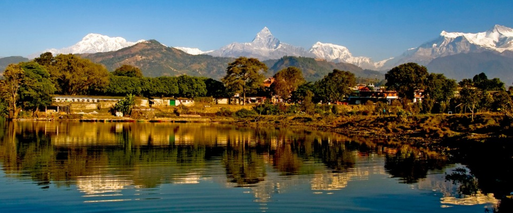

Pokhara is the main hub for the *Annapurna* region, it is mostly known for its peaceful lake and for some view points nto far from the city over the *Himalayan* mountains.

## Treks

A map with the different treks can be found [here](https://www.scribblemaps.com/create/#id=RM2yudxzwh).

### Annapurna Circuit

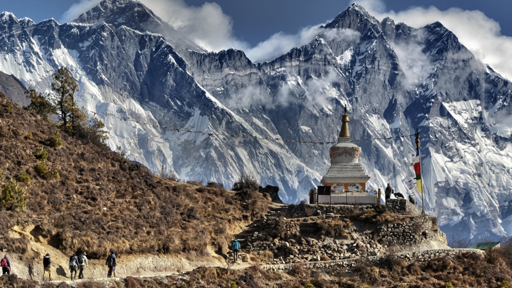

The *Classic* Himalayan trek, between 10 days to 2 week to finalize the whole tour with a maximum height of *5416 m*. The departure is *Besi Sahar* or *Bhulebule* and the end is at *Jomsom* or *Nayal Pul*. It can be combined with the *Annapurna Sanctuary* (10 days, medium, 4130 m) or other side trips such as the *Khopra Ridge Trek* (5-6 days, medium, 3660m) or the *Nar-Phu Treck* (7 days, medium to hard, 5320m).

### Annapurna Sanctuary

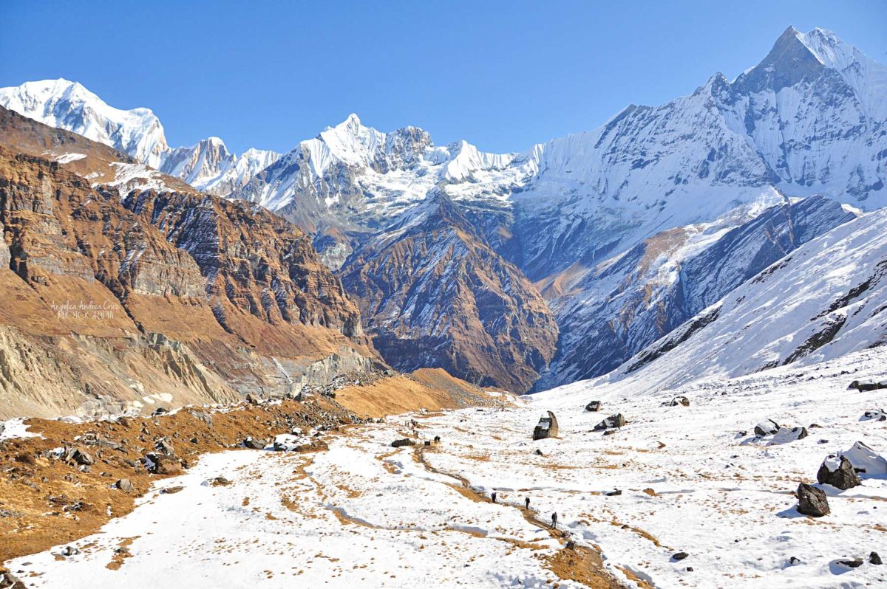

This shorter but wonderful trek take 10 days from *Phedi* to reach the *Annapurna Base Camp* and come back to *Naya Pul*. This choice is shorter and easier (difficulty: medium) and the maximum altitude is "only" *4130 m*. However the view is splendid from the center of the Annapurna complex.

### Annapurna Panorama Trek

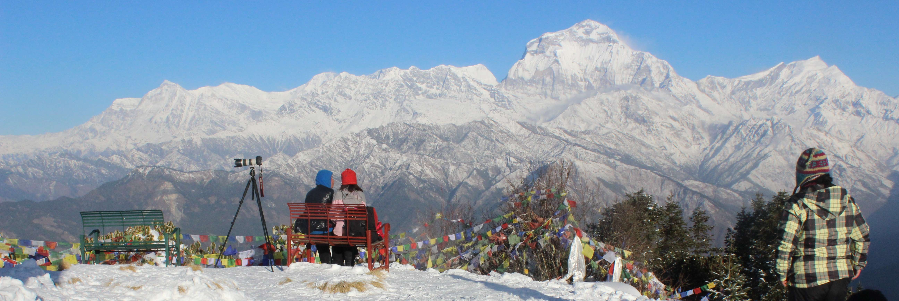

The *Annapurna Panorama trek* also known as *Annapurna Poon Hill trek* is a shorter and easier trek, it takes around 5-6 days to go from *Naya Pul* to *Phedi* reaching a maximum altitude of *3210 m*, it is graded easy to medium. During this days the hikers will pass by the *Gurung* village of *Ghandruk* and have a magnificent view of the *Machhapuchhare mountain* (in the picture above).   

### Everest Base Camp Trek

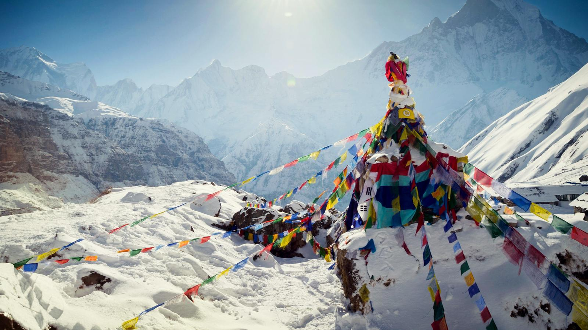

This is probably the more known trek of *Nepal* and it takes you from *Lukla* to the mythic *Everest Base Camp* and back in around 16 days, reaching *5545 m* and rated medium to hard. Its teahouses are probably the best around *Nepal*. It is quite physical however very rewarding both in views and emotions. The trail pass around many *Sherpa* villages and temples and some side trip (in particular during the acclimatization days) are very interesting. However the view of the *Everest* mountain is not the more spectacular and other (less known) mountains are far more impressive.

### Gokyo Trek

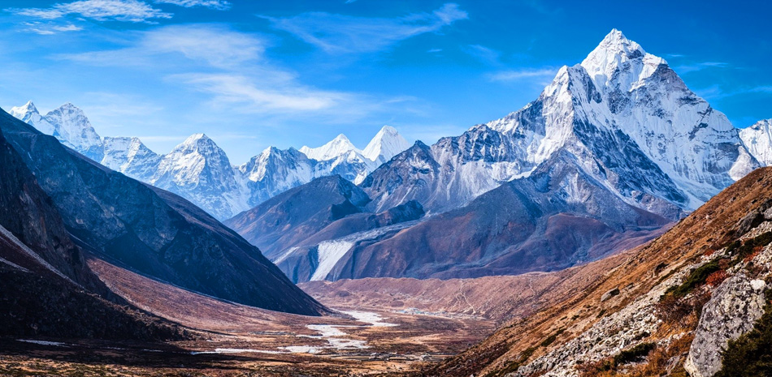

This trek in the *Everest Region* is less crowded but equally beautiful, with dramatic passes and views. It starts and ends in *Lukla* and share the firsts and lasts days with the *Everest Base Camp* trek, however it takes only 12 days to complete it but it still reach the maximum altitude of *5360 m* at the *Gokyo Ri* pass (shared with the *Three Passes Trek*) and it is graded medium to hard (as the *E.B.C.*). The villages passed on this trek seems more authentic and real than in the *E.B.C.* but the views are as spectacular. It is possible to combine it with *E.B.C.* branching to the base camp from *Lobuche* (info [here](http://www.ultimateeverest.com/everest-base-camp-gokyo.htm)).

### Mustang Trek

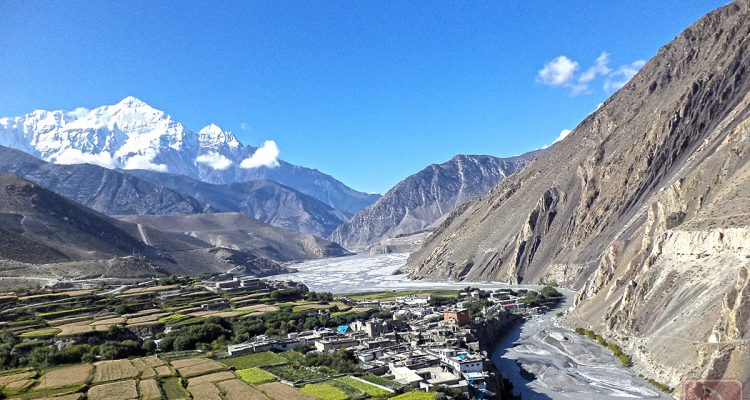

The trek in the *Mustang* region take you to a high-altitude desert full of colors and history. The inhabitants of this valley are mainly of *Tibetan* origins and thanks to its relatively high isolation their uses and costumes are still *Tibetan*. The trek takes 10 days to do a round trip between *Kagbeni* and *Lo Manthang*  the capital of the region of *Lo*. The difficulty is medium to hard and reach a maximum altitude of *4325 m*. A possible alternative route is to pass trough *Dhi*, Tange and finally *Muktinath*. 

### Manaslu Trek

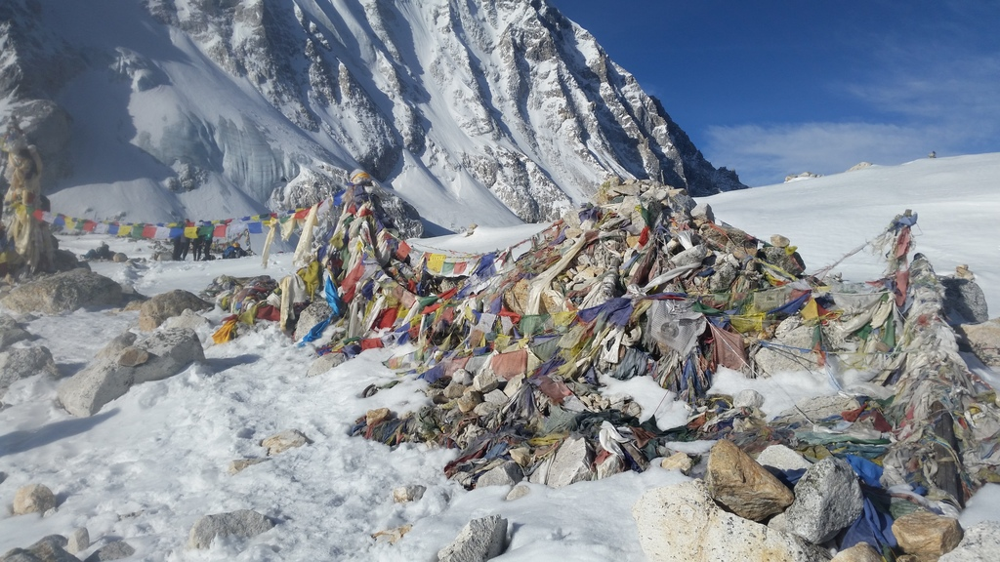

This trek before the 2015 earthquake was gaining the reputation of best trek of Nepal, as 2017 it seems that the trek is restored and teahouses are again operative. It offers many beautiful views and high altitude passes as the Annapurna but with much more less crowds. It takes 16 to 14 days to go from *Khorola Besi* (day 3 on the guide) to *Tilje* (day 14 on the guide) whit a maximum altitude of *5135 m* and a overall medium difficulty. The season is between mid-March to May and from October to mid-December.

More information [here](http://manaslucircuittrek.com/3610/manaslu-trek-fresh-info/).

### Inner Dolpo

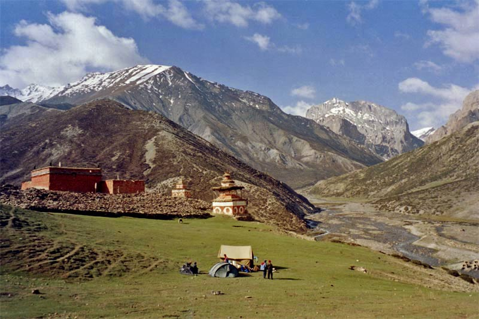

This region have many interesting treks, the more significant is the **Phoksumodo lake via Do Trap Trek**  that in only 10 days gain to passes of over 5000  meters and reach a maximum altitude of *5290 m* in a very isolate and remote valley where the local *Tibetan* culture is still authentic. However this trek is rated hard. Another possible itinerary is the **Beni to Dolpo Trek**, famous trough the books: *Stones of Silence* and *The Snow Leopard*, this time it takes 12 days to go from *Beni* to *Dunai* reaching a maximum altitude of *4540 m* and rated medium to hard.

Both of this treks are **camping only**.

### Makalu Base Camp Trek

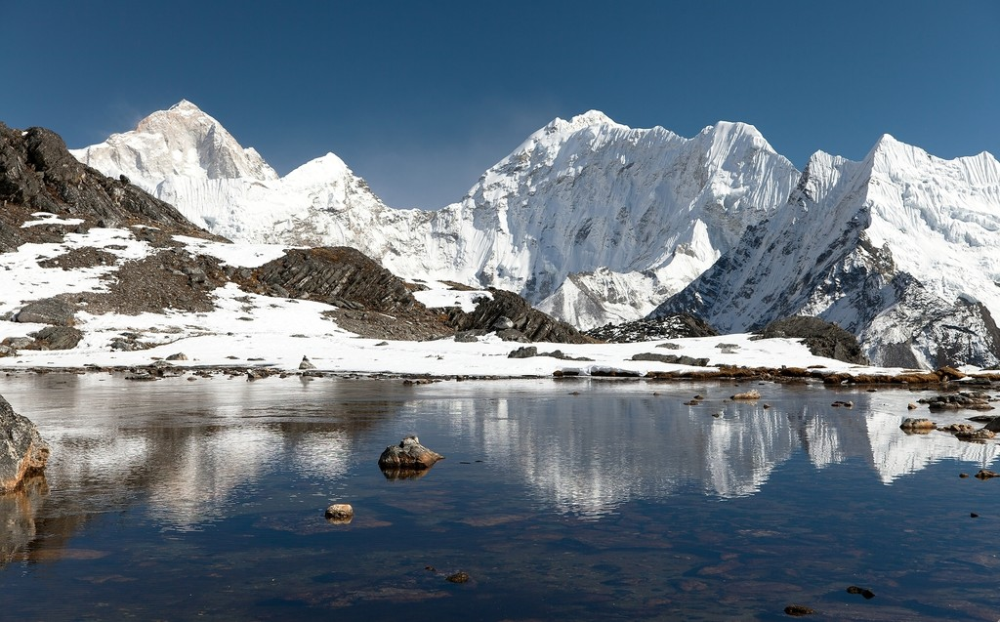

A rough trek above the *Makalu* mountain, the 5th highest peak in the world, at the border with *India*. This is a place is very isolated and is rich of different tribes. The trek take 13 days to go from *Num* to the base camp and back, however is rated hard. Between the many view point the most known are the *Throne of God*, the *Baruntse* and the east side of the *Everest range*. 

## Volunteering
